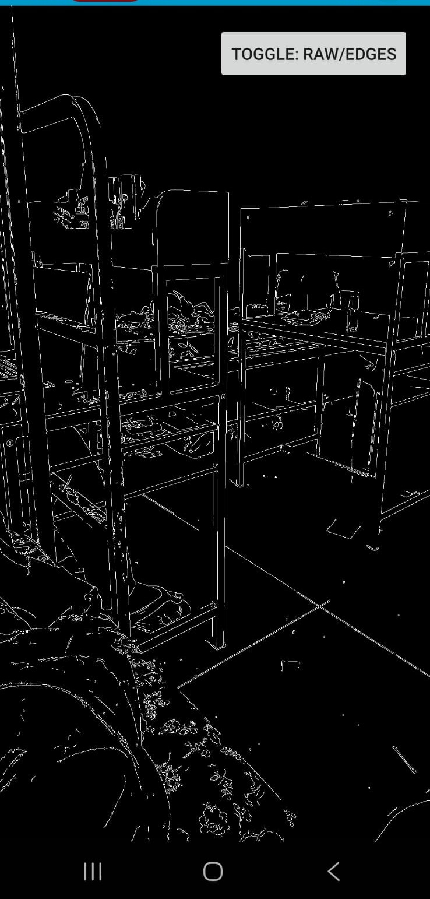
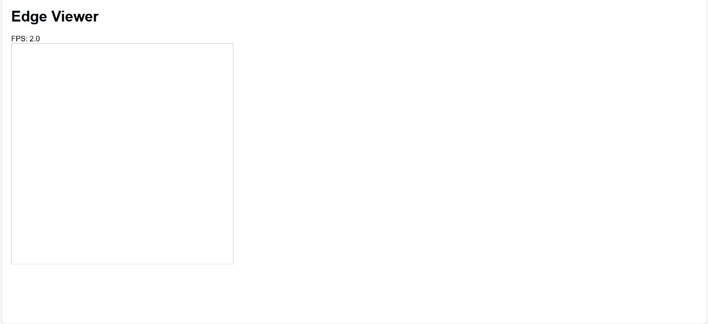

# 🧠 Real-Time Edge Detection Viewer

A cross-platform **real-time edge detection viewer** built using **Android (Kotlin + OpenCV + OpenGL ES)** and a **TypeScript-based web viewer**.  
Captures camera frames, processes them in **C++ via JNI**, renders them with **OpenGL ES**, and displays a static frame on a **web page**.

---

## ✅ Features Implemented

### Android Features

| Feature | Description |
|---------|-------------|
| 📷 **Camera Feed Capture** | Captures live frames using **Camera2 API** and displays them on a `TextureView`. |
| ⚙️ **OpenCV Processing (C++)** | Applies **Canny Edge Detection** or **Grayscale** via JNI using native C++ code in `jni/`. |
| 🎨 **OpenGL ES Rendering** | Renders processed frames as textures using **GLRenderer** from `gl/`. |
| 🟢 **Feed Toggle** | Switch between raw camera feed and processed (edge-detected) output. |

### Web Features

| Feature | Description |
|---------|-------------|
| 💻 **Web Viewer** | Displays a static processed frame from the Android app (saved as base64) using **TypeScript + HTML**. |
| 🌐 **Mock Server** | Simple mock endpoint serves frames to the web viewer for visualization or debugging. |

### Bonus Features Implemented

- 🎭 **OpenGL Shaders** – Apply optional visual effects like grayscale or invert.  
- 🌐 **Web Integration** – Optional real-time frame export to the web viewer.  

---

## 📷 Demo Showcase

### 🏸 1️⃣ Real-time Edge Detection — *Badminton Racket Demo*
<p align="center">
  
  <br/>
  <em>Edges captured and processed in real-time — contours of the racket and background clearly detected.</em>
</p>

---

### ✋ 2️⃣ Real-Time Motion — *Hand Movement Demo*
<p align="center">
  
  <br/>
  <em>Demonstrating real-time detection speed and stability while the hand moves across the frame.</em>
</p>

---

### 💻 3️⃣ Real-Time Motion — *Laptop Edge Detection Demo*
<p align="center">
  
  <br/>
  <em>Edge contours of the laptop surface and keyboard — processed via native C++ OpenCV and rendered through OpenGL ES.</em>
</p>

---

### 📱 4️⃣ App Screenshot — *Edge Detection Output UI*
<p align="center">
  
  <br/>
  <em>Processed frame displayed within Android app’s OpenGL texture view.</em>
</p>

---

### 🌐 5️⃣ Web Viewer — *Static Frame Display*
<p align="center">
  
  <br/>
  <em>TypeScript + Node.js based web viewer displaying exported processed frame.</em>
</p>

---
## ⚙ Setup Instructions (Android + Web, NDK & OpenCV)

### 1️⃣ Prerequisites

- **Android Studio** (latest stable)  
- **Android SDK & NDK** installed (ensure NDK path set in Android Studio: `File → Project Structure → SDK Location → NDK`)  
- **OpenCV Android SDK** installed (set correct path in `CMakeLists.txt` and Gradle)  
- **local.properties** file must include paths for SDK, NDK, and OpenCV:
  ```properties
  sdk.dir=/path/to/android/sdk
  ndk.dir=/path/to/android/ndk
  opencv.dir=/path/to/OpenCV-android-sdk
  ```
- **Node.js & npm** (for web viewer)  
- USB Debugging enabled on Android device

> **Note:** Verify that NDK version matches Gradle `externalNativeBuild` configuration and OpenCV include/lib paths are correct.

---

### 2️⃣ Clone Repository

```bash
git clone https://github.com/tanuku-saikarthik/Real-Time-Edge-Detection-Viewer.git
cd Real-Time-Edge-Detection-Viewer
```

---

### 3️⃣ Android Studio Setup (Including NDK, OpenCV & local.properties)

1. **Open Project**  
   - Open Android Studio → *Open Existing Project* → select `app/`.

2. **Move Native Code** (Optional, for conventional Android Studio structure)

```bash
mkdir -p app/src/main/cpp
mv jni app/src/main/cpp/
mv gl app/src/main/cpp/
```

3. **Update CMakeLists.txt**  
Ensure OpenCV paths are set correctly using `local.properties` if needed:

```cmake
add_library(edge_detector SHARED
    app/src/main/cpp/jni/edge_detector.cpp
    app/src/main/cpp/gl/gl_renderer.cpp
)

# Include OpenCV SDK headers
include_directories(${OpenCV_INCLUDE_DIRS})
link_directories(${OpenCV_LIB_DIR})
target_link_libraries(edge_detector ${OpenCV_LIBS})
```

4. **Update `app/build.gradle.kts`**

```kotlin
android {
    ...
    externalNativeBuild {
        cmake {
            path = file("../jni/CMakeLists.txt")
            version = "3.22.1"
        }
    }
}
```

5. **Sync Gradle**  
   - Click **File → Sync Project with Gradle Files**.  
   - Ensure NDK, OpenCV paths, and local.properties values are detected correctly.

6. **Connect Device & Run**  
   - Enable USB debugging.  
   - Click **Run → App** (Shift+F10).  
   - Check **Logcat** for native logs confirming OpenCV initialization and rendering.

---

### 4️⃣ Build & Run via Terminal (Optional — No folder restructuring or path adjustments needed)

```bash
# Assemble APK
./gradlew assembleDebug

# Install APK
./gradlew installDebug

# Launch App
adb shell am start -n com.karthik.edgedemo/.MainActivity
```

---

### 5️⃣ Web Viewer Setup

```bash
cd web
npm install
npm run start
```

Opens a browser page showing a static processed frame.

---

### ✅ Verification Checklist

| Step | What to Check |
|------|---------------|
| 🧩 NDK & OpenCV Paths | App builds without native errors |
| 🎨 OpenGL Renderer | Frames render smoothly with edges |
| 🧮 JNI Bridge | Logs show “JNI initialized” |
| 🌐 Web Viewer | Web page loads the static frame successfully |


## 🧠 Architecture Overview

### System Flow

```mermaid
flowchart TD
    A[📱 Android Camera Feed] -->|Captured Frame| B[🔗 JNI Bridge]
    B -->|Passes Frame| C[⚙️ Native C++ Layer]
    C -->|OpenCV Processing| D[🧠 Edge Detection / Grayscale]
    D -->|Processed Frame| E[🎨 OpenGL ES Renderer]
    E -->|Renders Texture| F[📲 Android App UI]

```



### Component Hierarchy


**Explanation:**  
- **Android App:** Captures frames → JNI → renders via OpenGL ES.  
- **Native Layer:** Processes frames in C++ with OpenCV, optionally applies shaders.  
- **Web Viewer:** Displays dummy/static frames using TypeScript + HTML.

---

### 🔧 Tech Stack

- **Android:** Kotlin, Camera2 API, NDK, JNI  
- **Native:** C++ + OpenCV  
- **Rendering:** OpenGL ES 2.0, GLSL shaders  
- **Web:** TypeScript, HTML, Node.js

